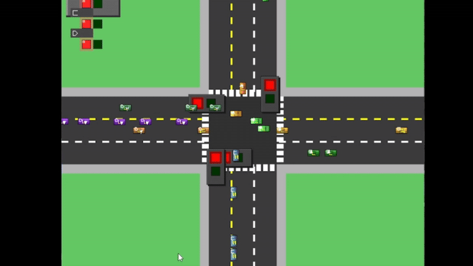

# Traffic Junction Simulator 🚦

A data structure and algorithms project implementing a queue-based traffic management system for a four-way intersection with priority lanes and free-turning lanes.



## 📋 Overview

This project simulates a traffic junction where vehicles navigate through an intersection governed by traffic lights and lane-specific rules, demonstrating the practical application of queue data structures.

### ✨ Key Features

- **Queue-based Traffic Management**: Using linear data structures to solve a real-world problem
- **Multiple Lane Types**:
  - **Regular Lanes**: Served based on traffic light signals
  - **Priority Lane (A2)**: Gets precedence when it has >10 vehicles, until count drops <5
  - **Free Lanes (L3)**: Always allowed to turn left regardless of traffic light state
- **Dynamic Traffic Light Timing**: Light duration calculated based on waiting vehicle count
- **Realistic Vehicle Movement**: Proper queueing, turning animation


## 🔍 Implementation Details

This simulator implements the following data structures and algorithms:

### 📊 Data Structures
- **Basic Queue**: FIFO queue for vehicles in each lane
- **Priority Queue**: Used for lane management with priority values
- **Waypoint System**: For vehicle pathfinding through the intersection

### 🧮 Algorithms
- **Traffic Light Calculation**: `Total time = |V| * t` where:
  - `|V|` = Average vehicles waiting = `(1/n) * Σ|Li|`
  - `n` = Number of normal lanes
  - `t` = Time per vehicle (2 seconds)
- **Priority Scheduling**: When Lane A2 exceeds 10 vehicles, it receives highest priority until count drops below 5
- **Free Lane Routing**: Lane 3 vehicles can always turn left regardless of traffic light state

## 🔧 Prerequisites

- C++17 compatible compiler (GCC 8+, Clang 7+, MSVC 19.14+)
- CMake 3.15 or higher
- SDL3 library

## 🏗️ Building the Project

### Installing SDL3

SDL3 is still in development and may not be available in standard package managers. You'll need to build it from source:

#### Linux
```bash
# Install development tools
sudo apt-get update
sudo apt-get install build-essential git cmake

# Clone SDL3
git clone https://github.com/libsdl-org/SDL.git -b SDL3
cd SDL

# Build and install
mkdir build && cd build
cmake .. -DCMAKE_BUILD_TYPE=Release
make -j$(nproc)
sudo make install
```

#### macOS
```bash
# Using Homebrew
brew install cmake git

# Clone SDL3
git clone https://github.com/libsdl-org/SDL.git -b SDL3
cd SDL

# Build and install
mkdir build && cd build
cmake .. -DCMAKE_BUILD_TYPE=Release
make -j$(sysctl -n hw.ncpu)
sudo make install
```

#### Windows
```powershell
# Clone SDL3
git clone https://github.com/libsdl-org/SDL.git -b SDL3
cd SDL

# Build with Visual Studio
mkdir build && cd build
cmake .. -DCMAKE_BUILD_TYPE=Release -G "Visual Studio 17 2022" -A x64
cmake --build . --config Release

# Install (run as administrator)
cmake --install . --config Release
```

Alternatively, you can build SDL3 and place it in a `libs/SDL3_install` directory within the project (this path is configured in CMakeLists.txt).

### Building the Traffic Junction Simulator

#### Linux/macOS
```bash
# Clone the repository
git clone https://github.com/sarbeshkc/dsa-queue-simulator.git
cd dsa-queue-simulator

# Create build directory
mkdir build && cd build

# Configure and build
cmake ..
make -j$(nproc)
```

#### Windows
```powershell
# Clone the repository
git clone https://github.com/sarbeshkc/dsa-queue-simulator.git
cd dsa-queue-simulator

# Create build directory
mkdir build && cd build

# Configure and build with Visual Studio
cmake .. -G "Visual Studio 17 2022" -A x64
cmake --build . --config Release
```

## 🚀 Running the Simulation

You need to run both the traffic generator and simulator:

1. Open two terminal windows
2. In the first terminal, run the traffic generator:
   ```bash
   # Linux/macOS
   ./bin/traffic_generator
   
   # Windows
   .\bin\Release\traffic_generator.exe
   ```
3. In the second terminal, run the simulator:
   ```bash
   # Linux/macOS
   ./bin/simulator
   
   # Windows
   .\bin\Release\simulator.exe
   ```

### 🎮 Controls

- **ESC**: Exit the application
- **D**: Toggle debug overlay with statistics

## 📂 Project Structure

```
dsa-queue-simulator/
├── CMakeLists.txt          # CMake build configuration
├              # Documentation and media
│── SarbeshKc.gif            # Demonstration animation
├── include/                # Header files
│   ├── core/               # Core simulation components
│   │   ├── Constants.h     # Simulation constants
│   │   ├── Lane.h          # Lane management
│   │   ├── TrafficLight.h  # Traffic light control
│   │   └── Vehicle.h       # Vehicle entity
│   ├── managers/           # Management classes
│   │   ├── FileHandler.h   # File communication
│   │   └── TrafficManager.h# Traffic flow control
│   ├── utils/              # Utility classes
│   │   ├── DebugLogger.h   # Logging system
│   │   ├── PriorityQueue.h # Priority queue implementation
│   │   └── Queue.h         # Basic queue implementation
│   └── visualization/      # Visualization components
│       └── Renderer.h      # SDL3 renderer
└── src/                    # Source implementations
    ├── core/               # Core components implementation
    │   ├── Lane.cpp
    │   ├── TrafficLight.cpp
    │   └── Vehicle.cpp
    ├── managers/           # Manager implementations
    │   ├── FileHandler.cpp
    │   └── TrafficManager.cpp
    ├── utils/              # Utility implementations
    │   └── DebugLogger.cpp
    ├── visualization/      # Visualization implementations
    │   └── Renderer.cpp
    ├── main.cpp            # Simulator main program
    └── traffic_generator.cpp # Traffic generator program
```

## 📝 Implementation Requirements

This project satisfies the following requirements from COMP202 Assignment #1:

1. **Linear Data Structures**:
   - Implementation of Queue for vehicle management
   - Implementation of Priority Queue for lane priority
   
2. **Traffic Conditions**:
   - Normal Condition: Vehicles served equally from each lane when traffic is balanced
   - Priority Condition: Lane A2 receives priority when it has >10 vehicles
   
3. **Lane Rules**:
   - L1: Incoming lane (vehicles arrive here from other roads)
   - L2: Regular lane that follows traffic light (can go straight or turn left)
   - L3: Free lane that always allows left turns regardless of light state
   

